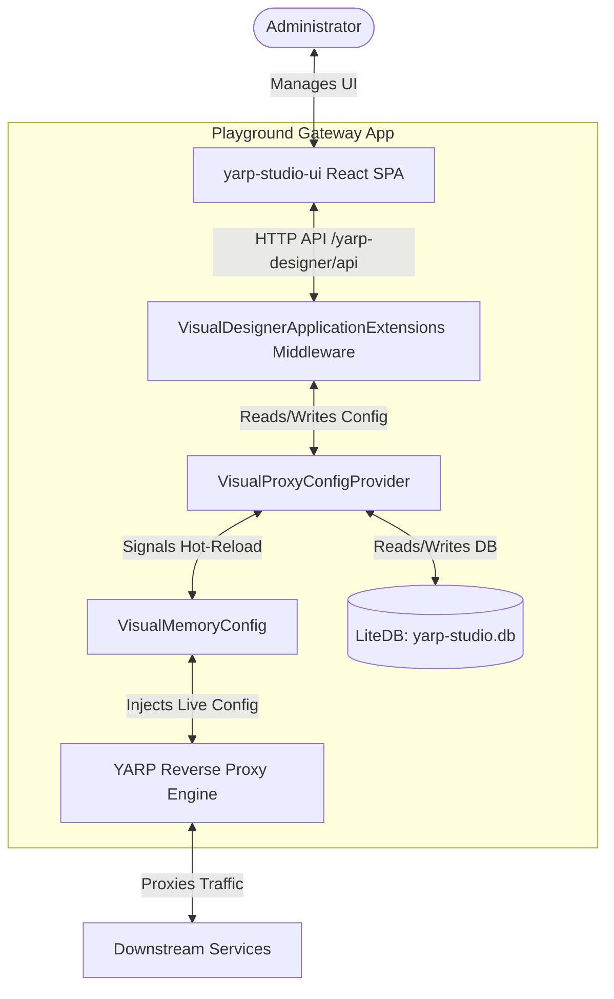

# YARP Studio

A modern, visual administrative dashboard and designer for **YARP (Yet Another Reverse Proxy)**. YARP Studio allows developers and administrators to manage reverse proxy configurations (routes, clusters, destinations) dynamically through a web interface, persisting changes to a lightweight embedded database with zero downtime hot-reloads.

---

## 🏗️ Architecture Overview

YARP Studio is split into a **backend library** (`Lgd.Yarp.Studio`), a **playground/gateway integration host** (`Playground.Gateway`), and a **frontend UI dashboard** (`yarp-studio-ui`).



### 1. Backend: .NET Core Engine (`Lgd.Yarp.Studio`)
- **`VisualProxyConfigProvider`**: A custom implementation of YARP's `IProxyConfigProvider`. It loads configuration from LiteDB upon startup and provides hot-reload capabilities by signaling token cancellations when updates occur.
- **`VisualMemoryConfig`**: An in-memory representation of YARP configuration (`IProxyConfig`) that gets dynamically swapped on the fly.
- **`VisualDesignerApplicationExtensions`**: Provides ASP.NET Core middleware (`UseYarpVisualDashboard`) that:
  - Exposes REST API endpoints (`/yarp-designer/api/config` & `/yarp-designer/api/save-config`) for state management.
  - Proxies SPA traffic to the Vite Dev Server (`http://localhost:5173`) in development.
  - Serves compiled UI assets embedded directly inside the DLL in production.

### 2. Frontend: React UI (`yarp-studio-ui`)
- **Vite + React (TypeScript)**: Core web-app stack.
- **shadcn/ui + Tailwind CSS**: Built with modern UI design patterns to deliver a premium, accessible, and clean interface.
- **Dashboard Features**:
  - **Routes Visualizer & Editor**: Define match criteria (paths, hosts, methods, headers), assign authorization policies, attach CORS, and map routes to backend clusters.
  - **Cluster & Destination Manager**: Configure backend clusters with load-balancing policies, session affinity, health checks, and manage individual destination addresses.
  - **Real-Time Config Updates**: Instantly saves configurations to the backend API, causing YARP to reload rules without restarting the process.

### 3. Database: Storage (`LiteDB`)
- Uses **LiteDB** (`yarp-studio.db`) as a serverless, embedded NoSQL database.
- Stores the entire proxy configuration layout in a document collection (`gateway_config`), updating a single active record to guarantee state persistence across application restarts.

---

## 🛠️ Tech Stack & Key Libraries

### Backend (.NET)
- **Framework**: .NET 10.0
- **Reverse Proxy**: [YARP (Yet Another Reverse Proxy)](https://github.com/microsoft/reverse-proxy)
- **Database**: [LiteDB](https://www.litedb.org/) (Embedded NoSQL database)
- **Hosting / SPA Integration**: `Microsoft.AspNetCore.SpaServices.Extensions` (for development forwarding)

### Frontend (React)
- **Build Tool**: [Vite](https://vite.dev/)
- **Language**: TypeScript
- **UI Framework**: React 19 (customizable to React 18 if needed)
- **Styling**: Tailwind CSS
- **Component Library**: [shadcn/ui](https://ui.shadcn.com/) (utilizing Radix UI primitives and Lucide React icons)

---

## 🚀 Getting Started

### Prerequisites
- .NET 10 SDK
- Node.js (v18+ recommended) & npm

### Running the Project

#### 1. Start the React Frontend Dev Server
Navigate to the UI project directory and start Vite:
```bash
cd yarp-studio-ui/yarp-studio-ui
npm install
npm run dev
```
The dev server will spin up by default on `http://localhost:5173`.

#### 2. Run the Gateway Host (Backend)
Navigate to the gateway host directory and start the ASP.NET Core application:
```bash
cd Playground.Gateway
dotnet run
```
Once running, navigate to `https://localhost:<port>/yarp-designer` or `http://localhost:<port>/yarp-designer` in your browser. Under development mode, all dashboard request assets are forwarded to your running Vite development server while API requests route directly into the .NET host application.
